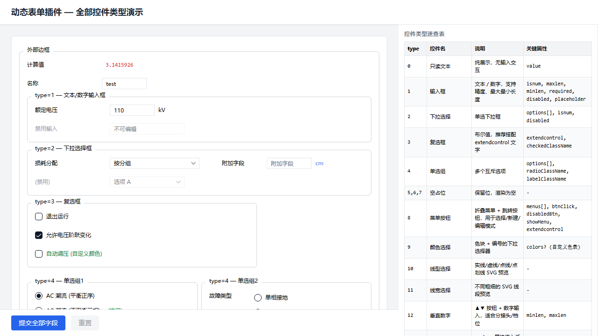

# dynamic-form-plugin

[](https://www.npmjs.com/package/dynamic-form-plugin)
[](https://github.com/awyb/dynamic-form-plugin)

声明式动态表单插件 — 基于 react-hook-form + shadcn/ui 的 Schema 驱动表单渲染引擎。



## 安装

```bash
pnpm add dynamic-form-plugin
```

### Peer Dependencies

确保项目中已安装以下依赖：

```json
{
  "react": "^18.0.0",
  "react-dom": "^18.0.0",
  "react-hook-form": "^7.0.0"
}
```

### Tailwind CSS 配置

本插件使用 Tailwind CSS 类名。确保你的项目已配置 Tailwind，并且在 `content` 中包含本包：

```js
// tailwind.config.js
module.exports = {
  content: [
    "./node_modules/dynamic-form-plugin/dist/**/*.js",
    // ...
  ],
}
```

## 快速开始

```tsx
import { useDynamicForm, DynamicForm, buildFld } from 'dynamic-form-plugin'

// 1. 定义 Schema
const schema = {
  type: 'default' as const,
  key: 'root',
  children: [
    {
      type: 'container' as const,
      key: 'basic',
      label: '基本信息',
      children: [
        {
          type: 'control' as const,
          key: 'name_row',
          flds: [
            buildFld({ name: 'loc_name', label: '名称', type: 1, isnum: 0, required: 1 }),
          ],
        },
        {
          type: 'control' as const,
          key: 'voltage_row',
          flds: [
            buildFld({ name: 'uknom', label: '额定电压', unit: 'kV', type: 1, isnum: 1, required: 1 }),
          ],
        },
      ],
    },
  ],
}

// 2. 使用 Hook
function MyForm() {
  const inst = useDynamicForm({
    schema,
    defaultValues: { loc_name: '', uknom: 10 },
    data: savedData,  // ← 自动回填
  })

  return (
    <div>
      <DynamicForm formInstance={inst} showInlineErrors />
      <button onClick={async () => {
        const values = await inst.submit()
        if (values) console.log('提交:', values)
      }}>
        提交
      </button>
      {inst.isDirty && <span>表单已修改</span>}
    </div>
  )
}
```

## 控件类型

| type | 控件 | 说明 |
|------|------|------|
| 0 | 只读文本 | 纯展示 |
| 1 | 输入框 | 文本/数字，支持精度、长度限制 |
| 2 | 下拉选择 | 单选下拉 |
| 3 | 复选框 | 布尔值，搭配 extendcontrol |
| 4 | 单选组 | 纵向互斥选项 |
| 5-7 | 占位 | 保留位 |
| 8 | 菜单按钮 | 折叠菜单 + 跳转按钮 |
| 9 | 颜色选择 | 色块预览 |
| 10 | 线型选择 | SVG 线段预览 |
| 11 | 线宽选择 | 线宽预览 |
| 12 | 垂直数字 | ▲▼ 增减按钮 |
| 999 | 自定义 | ReactNode |

## API

### `useDynamicForm(options)`

| 参数 | 类型 | 说明 |
|------|------|------|
| `schema` | `FormNode` | 表单 Schema 树 |
| `defaultValues` | `Record<string, any>` | 默认值 |
| `data` | `Record<string, any> \| null` | 回填数据 |
| `validate` | `(values) => true \| string` | 自定义业务校验 |
| `autoBackfill` | `boolean` | 是否自动回填 (默认 true) |

返回：
| 属性 | 说明 |
|------|------|
| `form` | react-hook-form 实例 |
| `submit()` | 校验并返回表单数据 |
| `reset()` | 重置为默认值 |
| `isDirty` | 表单是否修改 |
| `errors` | 字段错误 map |

### `DynamicForm`

| Props | 说明 |
|-------|------|
| `formInstance` | useDynamicForm 返回值 |
| `showInlineErrors` | 行内显示错误 (默认 false) |
| `precision` | 数字精度 (默认 12) |
| `onValidationError` | 校验失败回调 |

### `useMultiFormRef(sections)`

多表单编排器，合并多个 useDynamicForm 实例的提交/重置。

## Schema 结构

```ts
type FormNode = {
  type: 'container' | 'control' | 'default'
  key: string
  children?: FormNode[]
  flds?: FieldConfig[]     // control 专用
  label?: string | ReactNode
  props?: Record<string, any>
}
```

- `container`: SectionCard 分组卡片
- `control`: 控件行 (一行可多个字段)
- `default`: 无边框 div 容器

## License

MIT
